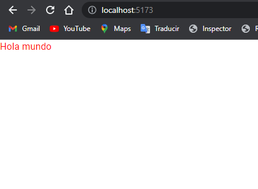

# Componentes

## ¿Que son los componentes?

En RenderJSON llamamos component a las porciones de UI donde mostramos informacion, existe dos timpos de componentes en RenderJSON los **Basicos** y los **Complejos**

### Componentes Basico

Los componentes basicos los elementos mas primitivos de una pagina web, si conoces de es decir target de HTML, como lo son `<h1>, <h2>, <h3>, , <div>, <p>, <section/>... etc `, que directamente le podemos mandar porpiedades sin utilizar la propiedad `prop` que manejamos en los componentes **Complejos** pero ya mas adelante hablaremos de ello...

Ejemplo de como podemos escribir un texto en la pagina:

<br/>

**Nota** `Para poder tarbajar debes ir a la ruta: https://{dominio}/admin/json`

```json
{
  "target": "p",
  "text": "Hola mundo",
  "name": "First-P",
  "style": {
    "color": "#ff0000"
  }
}
```

`Output`



| Propiedad | Valor             | Required | Significado                                                                                              |
| --------- | ----------------- | -------- | -------------------------------------------------------------------------------------------------------- |
| `target`  | Valor tipo `ITag` | `true`   | Toma como valor el tipo de elemento que se desea mostar todos los elementos [aqui](/docs/components/all) |

Independiente sea el [Plan](./prices/planes) que haya adquirido usted contara con estos componentes

### Componentes Complejos

Cada componente complejo tiene su repectiva documentacion de uso, donde se explica bajo que contexto se puede ustilizar y como se debe utilizar

### Este un listado de Componentes

Independientemente de que [Plan](./prices/planes) usted haya obtenido, cuenta con los siguientes componentes a continuacion

| Nombre               | Tag               | Tipo       | Realizado |
| -------------------- | ----------------- | ---------- | --------- |
| Pagina               | 'page'            | `Complejo` | ❌        |
| Titulo 1             | `h1`              | `Basico`   | ❌        |
| Titulo 2             | `h2`              | `Basico`   | ❌        |
| Titulo 3             | `h3`              | `Basico`   | ❌        |
| Titulo 4             | `h4`              | `Basico`   | ❌        |
| Titulo 5             | `h5`              | `Basico`   | ❌        |
| Titulo 6             | `h6`              | `Basico`   | ❌        |
| Texto                | 'p'               | `Basico`   | ❌        |
| Link                 | 'link'            | `Basico`   | ❌        |
| Imagen               | 'img'             | `Basico`   | ❌        |
| Contenedor           | 'flex'            | `Basico`   | ❌        |
| Formulario           | 'form'            | `Complejo` | ❌❌      |
| Top Bar              | 'top-bar'         | `Complejo` | ❌        |
| Left Bar             | 'left-bar'        | `Complejo` | ❌❌ ❌   |
| Header               | 'header'          | `Complejo` | ❌ ❌     |
| Footer               | 'footer'          | `Complejo` | ❌ ❌     |
| Formulario Login     | 'login-form'      | `Complejo` | ❌ ❌❌   |
| Botton Logout        | 'logout-button'   | `Complejo` | ❌ ❌ ❌  |
| Vitrina de Productos | 'product-summary' | `Complejo` | ❌ ❌ ❌  |
| Botton Social        | 'soccial-button'  | `Complejo` | ❌        |

❌ realizado pero no documentado
❌❌ realizado pero no finalizado
❌❌❌ no realizado
✅ realizado y documentado
